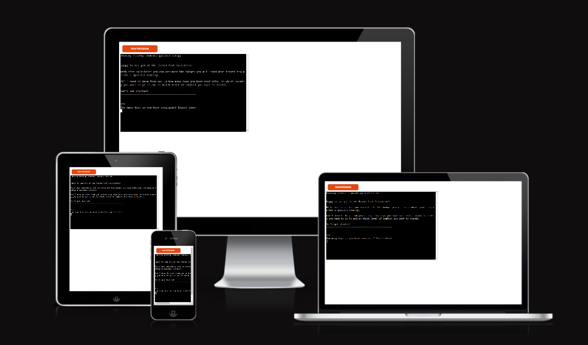
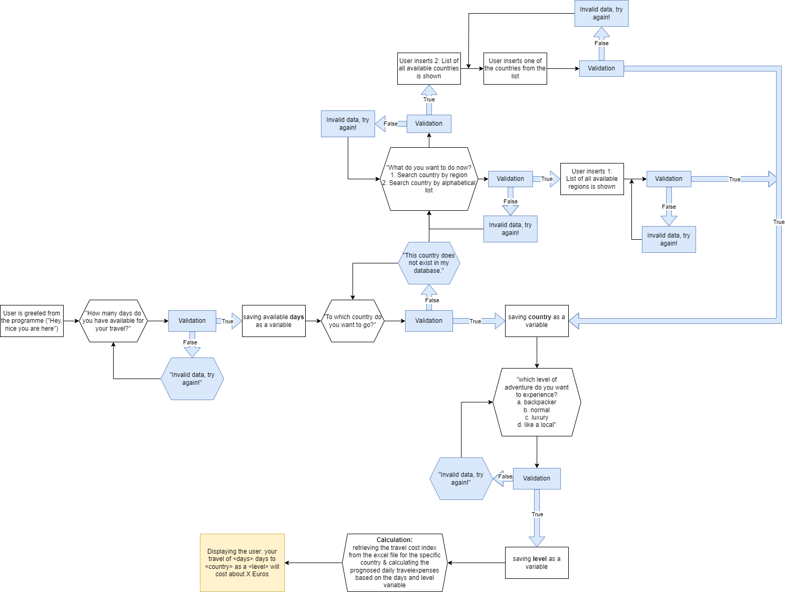

# Travel Cost Calculator

Welcome to the Travel Cost Calculator - a friendly tool to help you estimate how much money you will need for your next travel!

[Link to the deployed website](https://travel-cost-calculator-3797e090db48.herokuapp.com/)

---

## Table of Contents

- [Travel Cost Calculator](#travel-cost-calculator)
  - [Table of Contents](#table-of-contents)
  - [Objective](#objective)
  - [Brief](#brief)
  - [UX &#8722; User Experience Design](#ux--user-experience-design)
    - [User Requirements](#user-requirements)
      - [First Time User](#first-time-user)
      - [Returning User](#returning-user)
      - [Interested Party](#interested-party)
    - [Initial Concept](#initial-concept)
  - [Logic](#logic)
    - [Logical Flow](#logical-flow)
  - [Features](#features)
    - [Existing Features](#existing-features)
    - [Features Left to Implement](#features-left-to-implement)
  - [Data Model](#data-model)
  - [Technologies Used](#technologies-used)
    - [Python Packages](#python-packages)
    - [Other Tech](#other-tech)
  - [Testing](#testing)
  - [Deployment](#deployment)
    - [Heroku](#heroku)
  - [Credits](#credits)
    - [Content](#content)
    - [Media](#media)
    - [Acknowledgements](#acknowledgements)

---

## Objective

The objective is to write a programme which calculates the travel costs that can be expected going to a certain country, for a certain time and at a certain level of comfort.
The project should run in a CLI, deployed via Heroku, using Python.

***The needs within this project are not genuine and are made purely
for the purpose of completing my Code Institute project***

---

## Brief

The goal of this programme is to provide knowledge of what costs can be expected for a travel (excluding the initial transportation by bus, train, airplain etc. to arrive there and get back). The final version of this programme should:

- be programmatically error free
- be written using Python
- have a database for >100 countries
- handle all user input errors gracefully and appropriately
- give clear instructions regarding use and valid inputs

---

## UX &#8722; User Experience Design

### User Requirements

#### First Time User
<ul>
  <li>as a first time user I am interested in the travel costs that I can expect on a daily basis as well as for the whole length of my travel</li>
  <li>as a programmer I would like to be able to provide a clear, useful and easy to use programme</li>
</ul>

#### Returning User
<ul>
  <li>as a returning User I am interested in financially planning the upcoming travel</li>
  <li>as a frequent traveller I maybe will want to compare the travel costs in different countries</li>
</ul>

#### Interested Party
<ul>
  <li>as someone who is interested in how the programme functions, I want to see how the code was written, what the data source is and how the user inputs are validated </li>
</ul>

### Initial Concept

The first idea came up when I was thinking about the question how many days I could spend in a specific country with a certain budget. I was interested in such a calculation because I was in this situation in the beginning of this year. Thinking through the idea of writing a python programme that answers this question, I reason that most people normally have a certain amount of time available and want to know the budget they need, rather than having endless time and a certain budget. So here we are, now there is a programme telling you roughly how much budget you can expect for your next travel. The data will of course not be accurate for each individual person, but it can be a start and help planning.

---

## Logic

The logic behind the programme is displayed below in a flow chart that is made with [draw.io](#technologies-used).

### Logical Flow

Flow Chart

---

## Features

### Existing Features
<ul>
  <li>Entering the programme</li>
  <li>Accepting user input</li>
  <li>Input validation and error-checking for each user input with while loops</li>
  <li>Guiding the user by reactions to her/his input</li>
  <li>Saving input as variables</li>
  <li>Calculating an Index based on the variables</li>
</ul>

### Features Left to Implement
<ul>
<li>Having a main menu where the user can always come back to</li>
<li>Having the questions displayed on different pages</li>
</ul>

---

## Data Model
I use a google workbook to access the data that I retrieved and combined from [these two websites](#media). There are three worksheets, one containing the travel-cost-indices, one containing the living-cost-indices that are used if a user chooses to travel by living in a country "like a local". And finally, there is one with the countries divided in regions in case the country the user inserts cannot be found in the data base and she/he can search for the country in a list of regions.
There are multiple functions being triggered when the user starts inserting data, validating and storing the data in variables where they are used in the end to calculate a Travel Cost Index per day and for the length of the whole trip.

---

## Technologies Used

### Python Packages

- [gpspread](https://pypi.org/project/gspread/): to retrieve data from the google workbook
- time: to give the user time to read the reactions to her/his data entry or instructions from the programme
- [google.oauth2.service_account](https://google-auth.readthedocs.io/en/stable/index.html): to validate credentials and grant access to google service accounts

### Other Tech

- [Draw.io](www.draw.io) : to generate the flow chart
- [Windows Snipping Tool](https://support.microsoft.com/en-us/windows/use-snipping-tool-to-capture-screenshots-00246869-1843-655f-f220-97299b865f6b): to generate screenshots for the README.md
- [PEP8](https://pep8ci.herokuapp.com/): to validate the Python code

---

## Testing

[Go to Testing file](TESTING.md)

---

## Deployment

### Heroku

This project was deployed using Code Institute's mock terminal for Heroku.

Steps for deployment:
- Fork or clone this repository
- Create a new Heroku app
- Set the buildbacks to Python and NodeJS in that order
- Link the Heroku app to the repository
- Click on Deploy

---

## Credits

### Content

- The data about the travel cost indices for different countries was retrieved from this website: https://www.budgetyourtrip.com/asia/rankings
- the data for the living cost indices was retrieved from the ranking on this website: https://livingcost.org/cost
- [stack overflow](https://stackoverflow.com/) was used for any kind of insecurities about how to use a method or function, as well as for specific questions or smaller bugs
- [w3 schools](https://www.w3schools.com/python/python_try_except.asp) was used to remember the exact syntax of functions or methods
- The love-sandwich project was used as an inspiration and in order to connect the google sheet to the programme
  
### Media

No media was used for this programme.

### Acknowledgements

Thank yous go to:
- my mentor Jubril Akolade for giving me tips and support in three interesting and helpful mentoring sessions
- Ed, one of the tutors, who helped me again - this time with a problem of my repository
- And finally, thanks to my flatmates and friends who distracted me in the right moments (for example when I was stuck with a problem) and made me jump in cool water or enjoy the sun before getting back to my code ;)

---
