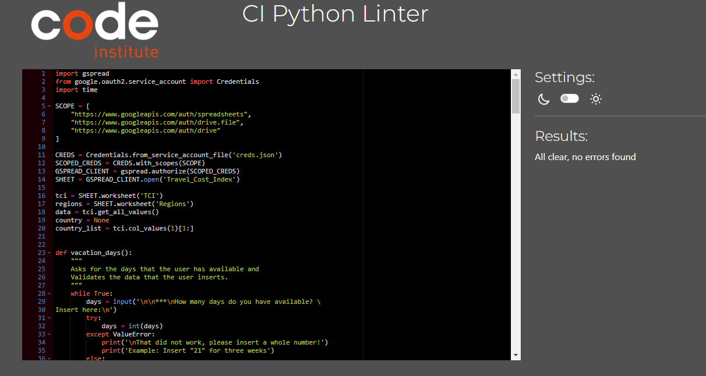

# Travel Cost Calculator -  Testing

[Back to README](README.md)

- - -

## CONTENTS

* [AUTOMATED TESTING](#automated-testing)
  * [PEP8 Testing](#pep8-testing)
* [MANUAL TESTING](#manual-testing)
  * [Manual Python Testing](#manual-python-testing)
  * [Testing User Stories](#testing-user-stories)
  * [Full Testing](#full-testing)
* [BUGS](#bugs)
  * [Solved Bugs](#solved-bugs)
  * [Known Bugs](#known-bugs)

- - -

## AUTOMATED TESTING

### PEP8 Testing

The code was passed through the [PEP8 linter](https://pep8ci.herokuapp.com/) and there are no problems

Testing Result

- - -

## MANUAL TESTING

### Manual Python Testing

I have manually tested this project by doing the following:
- given invalid inputs: when the user inputs invalid data she/he is notified and asked to try again
- tested in my loval terminal and the Code Institute Heroku terminal

### Testing User Stories

`First Time Visitors`

| Goals | How are they achieved? |
| :--- | :--- |
| I want to be able to use the Travel Cost Calculator by inserting data and choosing options | The Travel Cost Calculator lets the user insert data after it asked certain questions and gives options to choose from. |
| I want the Travel Cost Calculator to give me a Travel Cost Index as a result. | The Travel Cost Calculator calculates the Index based on the validated user input. |

`Returning Visitors`

|  Goals | How are they achieved? |
| :--- | :--- |
| I want to check the Travel Cost Index befor every travel that I have in mind. | The user can rerun the programme as many times as she/he wants, repeating it before different travels or to compare the different levels of adventure/comfort |

`Interested Party`

|  Goals | How are they achieved? |
| :--- | :--- |
| I want to understand the data, the underlying logic of the programme and how the data is validated | The interested person can check the data in the google spreadsheet and get the links to the websites where the Indices can be found from the README.md. The code is written according to the [python style guidlines](https://peps.python.org/pep-0008/#introduction) to ensure easy and clear readibility. The validation is done with while loops and try/except statements. |

### Full Testing

`Main Page`

| Feature | Expected Outcome | Testing Performed | Result | Pass/Fail |
| --- | --- | --- | --- | --- |
| The Sites title | Link directs the user back to the home page | Clicked title | Home page reloads | Pass |

- - -

## BUGS

### Solved Bugs

| No | Bug | How I solved the issue |
| :--- | :--- | :--- |
| 1 | One bug that I spent a lot of time fixing on was that I am using the global variable "country" in many functions and keep updating the variable in each function. At some point I got only error messages in the end when calculating the Travel Cost Index because the formular get_tci() was retrieving the country variable not as the last updated and validated version, but some stage before. | I remembered what is repeatedly stated in the course: to use print statements for debugging. So I printed out the variable at any stage where it is being updated - and that helped in the end to find the error in the formular validate_country() |

- - -

### Known Bugs

| No | Bug | |
| :--- | :--- | :--- |
| 1 | No known bugs |  |
